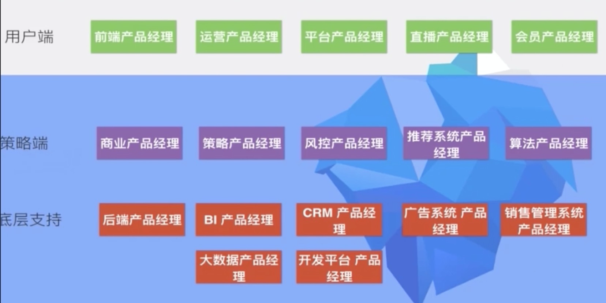
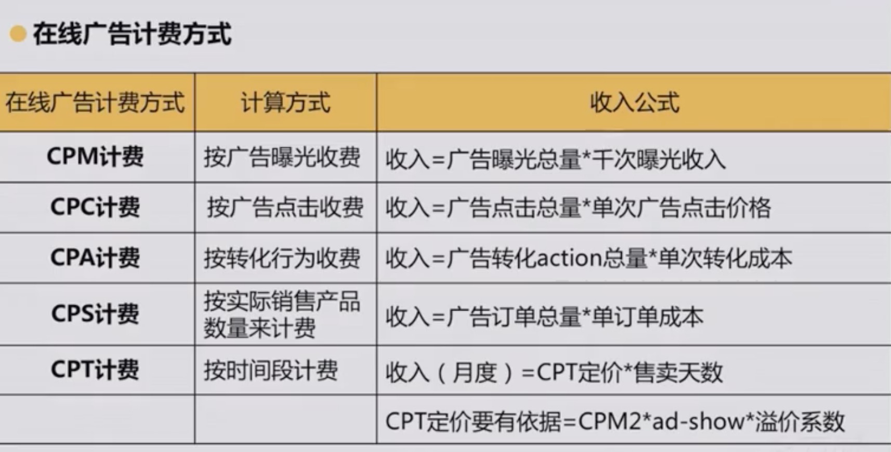
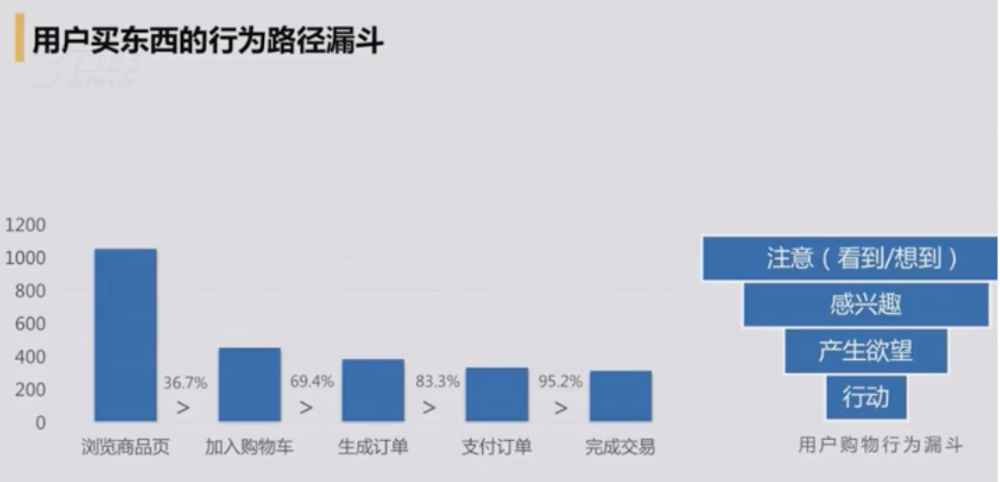
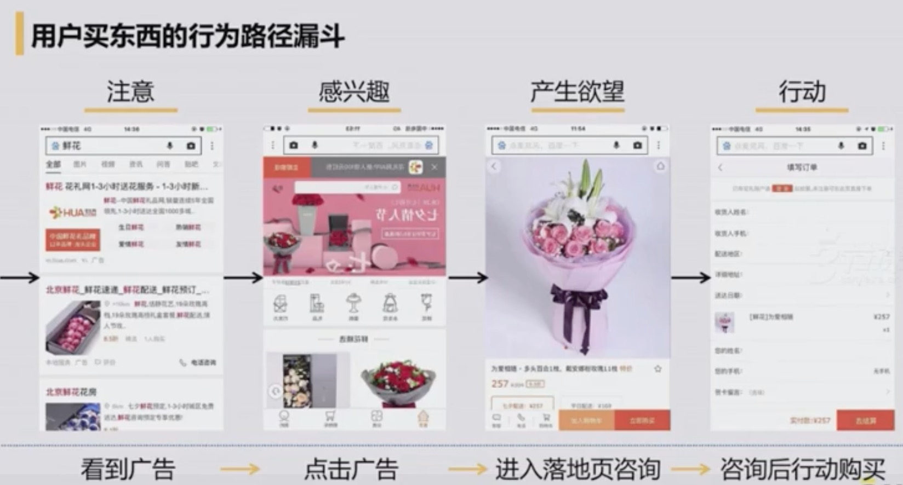
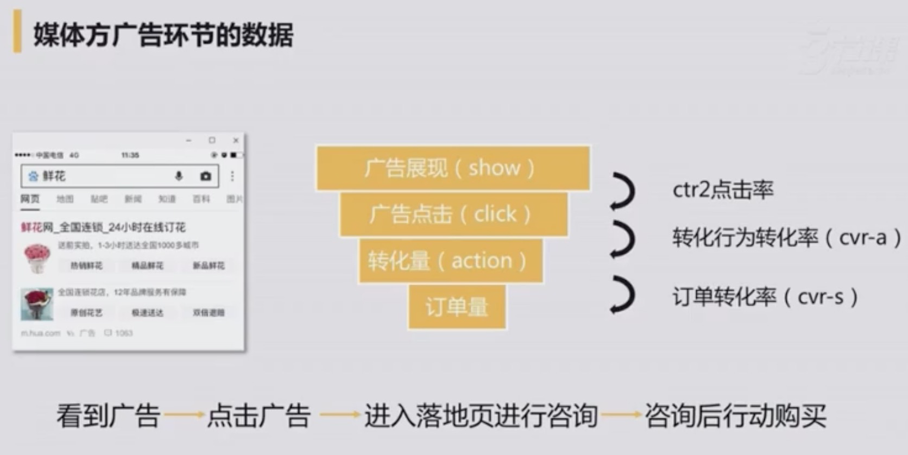
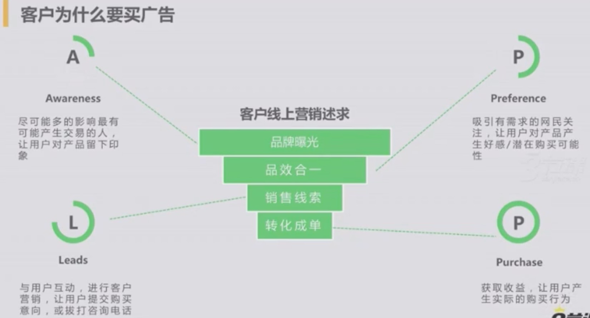
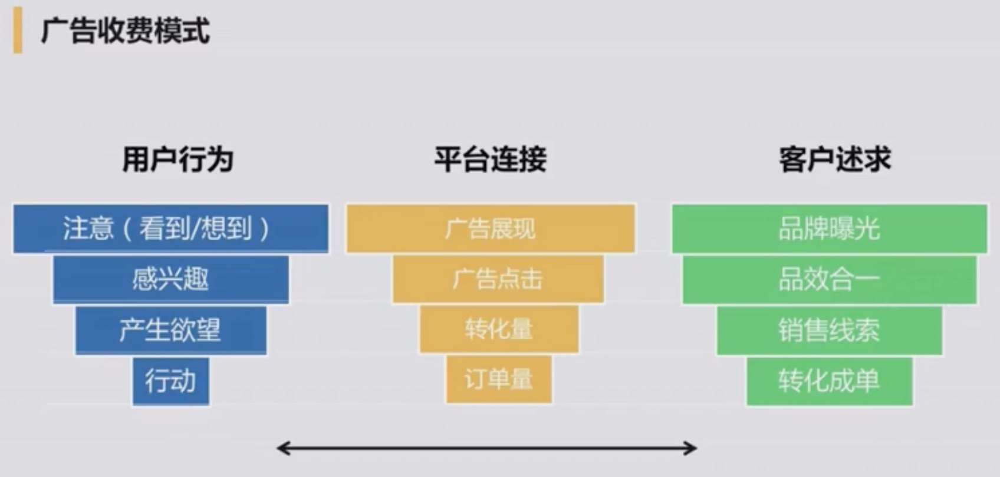
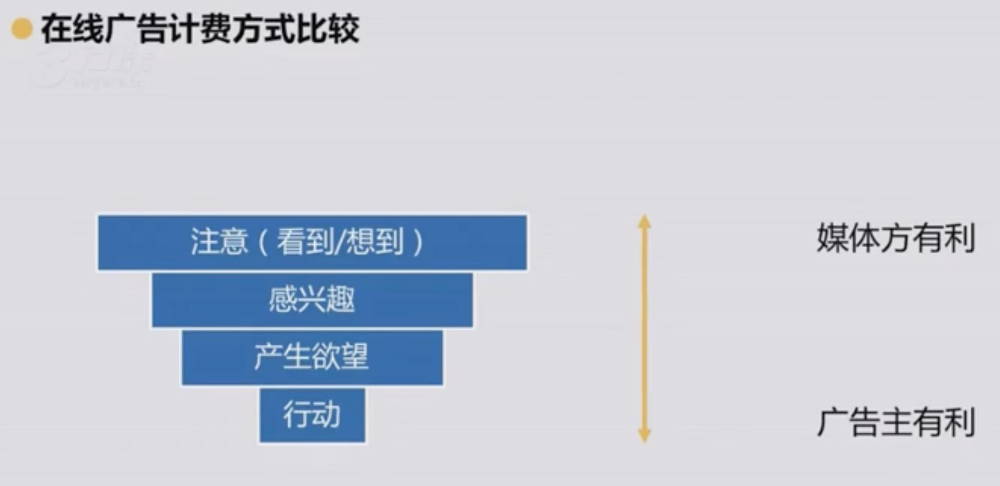
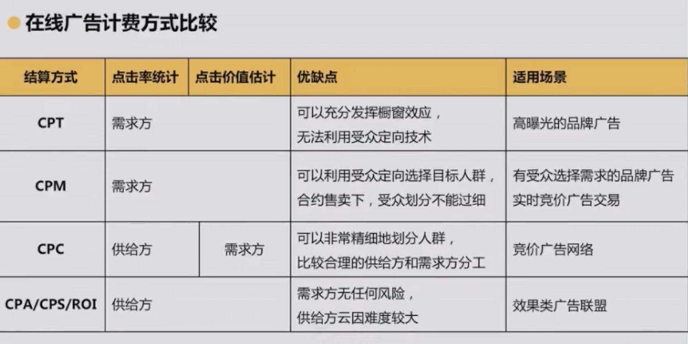

# PM

## 互联网

### 互联网认知和发展史

- 启蒙元年：~ 1994/1995
  - 国外： 雅虎、暴雪、eBay、Amazon
  - 国内: 商用元年、行业启蒙
- 探索挖掘: ~ 1998/1999
  - 国外：泡沫破裂
  - 国内：黄金年份
    - 腾讯成立
    - 新浪成立
    - 搜狐成立
    - 网易成立
    - 盛大成立
- 群雄逐鹿: ~ 2003/2005
  - 国外：逐渐转型
    - Facebook 成立
    - Google 上市
  - 国内：超级大年
    - 腾讯上市
    - 淘宝电商
    - 百度上市
- 局部一统: ~ 2006/2008
  - 国外：SNS
    - Facebook
    - Twitter
  - 国内：SNS
    - 开心网
    - 校内网/人人网
    - 51.com
    - QQ空间
- 巨头形成: ~ 2009/2011
  - 国外：
    - Groupon
    - Twitter
    - Uber
  - 国内
    - 团购
    - 微博
    - 小米成立
- 移动互联: ~ 2012/2015
  - 国外
    - VR
    - 大数据
    - 数字健康
  - 国内
    - 微信
    - 滴滴
    - O2O
- 互联网+: ~ 2015-至今

#### 中国互联网第一

- 第一家互联网企业：瀛海威
- 第一个纳斯达克的中国大陆网络股：新浪
- 第一个QQ号：10000（消息通知号）
- 第一次突破一亿网民：2005-06-30
- 第一条微博：你可以当我是个机器人
- 第一个网造节日：双十一

#### 参考书

- 《沸腾十五年》
- 《浪潮之巅》
- 《中国互联网20年：网络大事记篇》
- 《中互联网风云16年》
- 《时代的变化：互联网构建新世界》

#### 中国互联网发展现状

#### 发展现状的个人感受

- 国际领先 比肩世界：对比中美日韩欧/东南亚/印度等的发展
- 中国特色 尚有不足：C2C(Copy to China)/3Q大战/快播
- 剧透骄傲 新秀崛起：BAT/猎豹/小米等
- 略显浮躁 缺乏创新：假数据/伪需求/骗钱骗人
- 大势所趋 充满希望：国家战略 互联网+

#### 8个正在发生的重大产业趋势

#### 互联网就是未来

- 了解互联网就是了解未来
- 学习互联网就是学习未来
- 抓住了互联网就是抓住了未来

#### 国内市场和国外市场的区别

#### 如何处理市场分析的宏观和微观

- 宏观因素
  - 人文环境
    - 人口因素
    - 人口的地理迁移因素
    - 社会因素
  - 经济环境
    - 国民生产总值
    - 个人收入 反应购买力高低
    - 外贸收支情况
  - 自然环境
    - 自然资源 短缺和保护
    - 环境的恶化
    - 疾病的影响
  - 技术环境
    - 技术对企业 竞争的影响
    - 对消费者的影响
  - 政治法律环境
    - 政治格局的稳定
    - 国家的政治法律环境
  - 社会文化环境
    - 教育水平
    - 中教信仰
    - 传统习惯

- 微观因素
  - 供应者
    - 资源的保证
    - 成本的控制
  - 购买者
    - 私人购买者
    - 集团购买者
  - 中间商
  - 竞争者
    - 竞争者及其数量和规模
    - 消费者需求量与竞争供应量的关系
  - 公众
    - 金融公众
    - 政府公众
    - 市民行动公众
    - 地方公众
    - 企业内部公众
    - 一般群众
  - 企业内部各部分写作

### 互联网团队初期的组成

- CEO
  - 产品经理
  - 设计师
  - 研发人员
  - 运营

1. 产品上线，搞点儿用户

- 产品部门
  - 前端PM
  - 运营型PM

2. 用户增长，产品速度变慢；产品与研发的冲突，代码重构

- 产品部门
  - 前端型 PM
    - 前端 PM
    - 运营 PM
  - 后段 PM（前端的管理）

3. 要赚钱了；设立销售部门

- 产品部门
  - 前端
    - 前端 PM
    - 运营 PM
  - 策略端
    - 商业 PM（怎么赚钱）
    - 策略 PM（点击率太多，系统崩溃；策略的方式，系统自动化实现人力工作）
      - 广告匹配问题，上下线问题
      - B 轮以后的公司
    - 风控 PM
    - 推荐系统 PM
    - 算法 PM
  - 底层支持
    - 后段产品经理
    - BI PM（数据统计）
    - CRM PM （客户端管理）
    - 广告系统 PM
    - 销售管理系统 PM (渠道销售，分公司)
    - 大数据 PM
    - 开发平台 PM

### 互联网公司的常见角色

#### 产品经理

如果把产品开发当做赛龙舟产品经理就是站在最前面的擂鼓喊号的人

- 根据公司战略
- 协调多方资源
- 推动产品达到计划中的目标

#### 设计师

- 交互设计师（梳理结构流程&设计界面）
- 视觉设计师（用视觉符号传递信息）

#### 开发/测试/运维

#### 产品运营

## 产品经理的起源和分类

### 产品经理的起源

#### 产品经理的诞生 —— P&G

> 1926年，保洁公司（Procter&Gamble）祖泽姐妹香皂(Camary) 销售的麦克爱尔洛埃提出产品经理管理体制。前期市场调研，用户的需求挖掘，产品的设计和研发过程，到最后上线之后推广营销，能不能有一个来负责主导推动。

Because the people who are crazy enough to think they can change the world are the ones who do. Steve Jobs 活着，就是为了改变世界 1955-2011 乔布斯

#### 产品经理对行业的影响

**在产品中融入科技与人文**

- 淘宝/饿了吗/滴滴/安居客/微信 (产品经理让生活变得更美好)

### 产品经理职能

- 功能型：工具、软件等
- 运营型：策划、运营和推广等全局型
- 管理型：产品和业务、管理产品项目团队

### 产品经理发展介绍

- CEO 学前班（策划、财务、设计、技术、市场、运营、推广等）

### 产品经理工作内容

> 帮助团队为用户打造正确的产品

- 竞品分析
- 产品策划
- 需求实现
- 迭代优化

### 学习建议

- 不做伸手党
- 学会查找资料(wiki)
- 设计学习任务
- 先学会功能实现，再产品规划

- 电子商务
  - 模式
    - B2B (阿里巴巴)
    - C2C (淘宝)
    - B2C (京东)
    - O2O (美团)
  - 了解竞争对手产品（了解前台运营）
  - 开源项目产品(了解后台运营)

- google.com: "B2C 开源程序"

### 不同平台的产品类型

#### 按产品终端分

1. PC 端
2. Web 端
3. 移动端

[PC端和移动端对比](./images/pc_mobile.jpg)

[移动端和Web端对比](./images/mobile_web.jpg)

### 产品部门分类

- 用户/前端产品(海平面)
- 后端产品(海底) 趋势

### 不同行业的产品类型

[互联网元素周期表](./images/pro_type.jpg)

#### 1. 网络媒体1.0 - 门户网站

- Yahoo - 第一家提供因特网导航服务网站

- 中国五大门户
  - 搜狐
  - 网易
  - 新浪
  - 腾通
  - 凤凰

#### 网络媒体1.5 - 博客

- Blogger开创了媒体UGC方式

- 中国博客代表
  - 博客中国
  - blogbus

#### 网络媒体2.0 - 微博

- Twiter, 社会化分享带来媒体2.0
- 中国的微博之争
  - 新浪
  - 腾讯微博

#### 网络媒体新热点 - 重度化

- Youtube - 技术变革带来的媒体重度化

- 国内
  - 优化
  - 爱奇艺

- Autotrader 美国最大汽车分类网站
- 中国的汽车媒体：汽车之家，易车

#### 网络媒体新热点 - 移动化

- Flipboard，社会化阅读的移动化

- 中国移动阅读
  - 快报（腾讯）
  - 头条

#### 最早的社交网络

- BBS是最早的社交网络
  - 天涯
  - 猫扑
  - discuz
  - 西祠胡同

#### 社交网络的严谨

- Myspace 社区多媒体化
- Qzone 信息为中心到已人为中心
- Facebook 关系链为核心更好连接人
- LinkedIn 通用社交外的垂直化补充
- Moments 高频熟人社交广告价值高

#### IM - 及时通讯

- 聊天室的IM的鼻祖
  - 碧海银沙：www.yinsha.com
  - 网易/新浪/碧海银沙，最早的IM就是聊天室

#### IM的进化史

- ICQ 现代IM之母
- MSN 微软是软件公司
- Skype 软件思维害死人
- QQ 集大成里业之本
- WhatsApp 移动IM启蒙者(facebook收购)
- KaKao Talk 微信的导师
- LineTalk Wechat的竞品
- 微信 是一个生活方式

#### 最早的搜索引擎

《全球目录》最早的搜索引擎，是靠科技先知，人工搜集，分类和帅选完成的

- 中国分类网站
  - 58
  - 赶集
  - hao123 也是一种搜索引擎

#### 搜索引擎的格局

- Google
- 百度
- 360
- 搜狗

#### 搜索引擎的垂直细分

- Quora 知识价值维度的搜索
- 百度知识
- 知乎

### 虚拟商品

#### 前互联网时代的增值服务

- SP彩信/彩铃/IVR是最早的VAS业务

#### 腾讯的第一桶金

- 第二代VAS开始有了人格映射(AVATAR)
  - QQ会员
  - QQ秀

#### 虚拟产品盈利的案例

- YY直播
- 暖暖环游世界

- 影视产品直销的本质是虚拟产品
- 魔兽世界，人格化竞技性趋于极致
- QQ农场，人性极致释放，全民偷菜

#### 移动互联网时代虚拟商品

- 移动游戏 社群属性 大众触点 让移动游戏获得了更大的想象
- IM型社交属性(微信飞机大战) 让游戏扩散度 活跃度 大幅提升
- 移动游戏 PC时代无法想象的回报率

### 电商&O2O

- Amazon 实物电商的鼻祖
- Ebay/Paypal, 电商平台的鼻祖
- 阿里巴巴，最整合的电商平台

#### 垂直电商

- 京东：已经完成平台化的锐变
- 唯品会：精准定位切入的成功案例

#### O2O

- 携程，O2O的先行者
- O2O的领先者 决定性因素是线下的O
  - 大众
  - 美团
  - 滴滴
  - 58

#### 支付闭环

> 支付宝/微信钱包，连接服务支付的闭环

- 京东支付
- 支付宝
- 微信
- 百度钱包

- App Store: 特殊虚拟商店 本质是电商
- 360: 已安全为入口复杂流量转化
- 小米: 精简和Rom入口争夺战略地位
- UC：浏览器为入口复杂流量转化
- 高度：地图为入口 复杂流量转化
- Wifi 万能钥匙：上网为入口 复杂流量转化

- 石油、便利店、餐饮无数线下的入口

### 如何选择行业

- 优势：进入这个行业，你的优势是什么
- 热爱：是否热爱这个行业，为之付出的行动
- 市场：市场规模有多大，近几年增长情况是怎样的
- 竞争：主要竞争者有哪些，各自的市场中的分量如何
- 技术：这个行业的技术是否成熟，还有哪些瓶颈
- 门槛：进入这个行业的壁垒是什么

### 产品经理的工作职责

探索对用户有价值的、可用的、可行的产品 - eBay产品经理及设计高级VP Marty Cagan

#### 工作职责

a. 战略性工作
b. 设计性工作
c. 项目性工作
d. 市场性工作
e. 商业化工作

#### 战略性工作

- 内容
  - 产品战略研究和分析
  - 茶品规划 / 迭代规划
  - 用户分析和市场研究
- 能力
  - 数据分析和思辨能力
  - 战略工具的熟练使用

《定位》

#### 设计性工作

- 内容：交互 / UI / UE
- 能力：工具学习 / 思维训练 / 洞察思考

- 工具：Axure / 墨刀 / Mockplus

#### 项目性工作

- 内容
  - 流程规划
  - 时间管理
  - 任何和人员管理
  - 资源的整合运用
  - 达成项目的目标
- 能力
  - 沟通能力
  - 执行能力
  - 组织能力
  - 协调能力

- 项目管理的四要素
  - T 事件
  - S 范围
  - C 成本
  - Q 质量

#### 市场性工作

- 内容
  - 竞品管理
  - 商务沟通
  - 渠道管理
  - 运营推广
- 能力
  - 沟通能力
  - 调研分析
  - 商务谈判
  - 情商财商

#### 商业化工作

- 内容
  - 商业模式分析
  - 生命周期管理
  - 数据分析验证
  - 产品迭代优化
  - 做好市场拓展
  - 挖创新增长点
- 能力
  - 商业思维
  - 战略思维
  - 全局思维

#### 腾讯的产品经理模型

#### 产品经理的成长曲线

## 市场分析

### 市场分析的方式

#### PEST 分析

> 宏观环境的分析

在分析一个行业/企业/产品所出市场环境

行业/企业/产品：P政治，E经济，S社会，T技术

##### Political Factors

饭否为什么被关闭？“任大炮”微博为何被关？

网友发布了违法相关法律的言论也没有得到及时控制所造成的

- 新浪微博怎么做的？
  - 关键词过滤、封号等监管措施
  - 新浪管理层与政府之间良好的关系，能在某些擦边敏感问题上游刃有余的关键
  - 7*24人工客服快速响应

##### Economic Factors

- 经济因素
  - 利率
  - 通货膨胀率与人均就业率
  - 人均GPD的长远预期
- 除此之外
  - 财政货币政策、失业率水平、居民可支配收入水平、汇率、能源供给成本、市场机制、市场需求

##### Sociocultural Factors

- 社会因素
  - 信奉人数最多的宗教是什么？
  - 这个国家的人对于外国产品和服务的态度如何？
  - 语言障碍是否会影响产品的市场推广？
  - 这个国家的男人和女人的角色分别是什么？
  - 这个国家的人长寿吗？老年阶层富裕吗？
  - 这个国家的人对于环保问题是如何看待的？

##### chnological Factors

- 技术因素
  - 科技是否降低了产品和服务的成本，并提高的质量？
  - 科技是否为消费者和企业提供了更多的创新产品和服务，例如网上银行、新一代手机等？
  - 科技是如何改变分销渠道的，例如网络书店、机票、拍卖等？
  - 科技是如何改变分销渠道的，例如网络书店、机票、拍卖等？
  - 科技是否为企业提供了一种全新的与消费者进行沟通的渠道，例如 Banner广告条、CRM软件等？

### SWOT分析和价值曲线分析

> 对企业/产品内外部条件各方面内容进行综合和概括，今儿分析组织的优劣势、面临的机会威胁一种方法（较为宏观和主观）

- 将公司的战略与公司内部资源、外部环境有机地结合起来

- 优势劣势：相对于竞争对手来书偶的优劣，包括：组织能力、资源和技能等
  - 研发能力
  - 用户基础
  - 市场份额
  - 人力资源
  - 政府公关
  - 客服能力
  - 技术专利
  - 组织架构
- 机会风险：超出了你可控制范围内力量、问题、趋势、事件
  - 技术变化 新客户产生
  - 新市场出现 新商业模式
  - 法律法规变化 市场疲软
  - 趋势改变 政策变化
  - 竞争对 全球经济
  - 产品被替代 费用上涨

#### SWOT分析结果 - 组合矩阵

- 利用SWOT分析成果，做出**组合矩阵**，填在对应的表格

#### 价值曲线分析

定义：通过评价一个公司各关键要素的业绩表现，来评价顾客总体感知服务质量的方法。这里的各**关键要素，也是行业顾客总体评估的各种维度/价值点**

#### 价值曲线评价法的步骤

1. 确定行业内顾客感知服务质量的关键要素

各行业之间顾客感知的服务质量的**关键要素不同**

比如，酒店的关键要素：价格、安静程度、卫生、床的质量、房间的设备和舒适度、服务员的服务水平、房间大小、大堂装修、建筑美感、饮食、地理位置等

而对于航空公司的关键要素一般有：安全性、准点率、价格、机型、空姐仪表、航餐、积分等

2. 设计问卷进行市场调研，让顾客给各个要素打分

把关键要素调查问卷中，设计 0~9, 10个分数等级，让顾客根据**期望和要求**给要素打分。目的是找出大多数顾客普遍认为**重要/不重要的因素**以及产品提供的**多余因素**。

问卷最后要设计两个**开放性**问题：

您认为还应当**提供哪些重要的服务项目**？

你认为应当**去掉哪些冗余的服务项目**？

3. 评价价值曲线，提高顾客感知的服务质量

找出**分数最高**和**分数最低**的要素各**三个**，说明在顾客感知的服务质量中，他们分别是最重要和最不重要的三个

产品可以通过**淘汰**某些属性，**创建**某些属性/将某些属性**减少**或者**提升**到行业前所未有的水平组合应用，实现**价值曲线的突破**，从而更加符合顾客的期望和要求，**提高顾客感知的服务质量**

4. 监控价值曲线

产品一旦创造了新的价值曲线，竞争者迟早会企图模仿。为保住顾客群，团队可能陷入一场为取胜的竞争，为抓紧市场份额所困扰，于是，团队可能陷入传统战略逻辑的陷阱。

因此，**动态的应用价值曲线评价方法，即监控价值曲线是非常必要的**，它可使一个团队，在现今的服务中仍然能够得到一个巨大的利润时，就看到并及时抓住质的飞跃机会

## 互联网思维

### 互联网经济的四个特点

1. 用户至上
2. 体验为王
3. 免费的商业模式
4. 颠覆式创新

周宏伟：转型企业必须理解四个互联网经济特点

- 用户思维
- 简约思维
- 极致思维(超出预期)
- 跨界思维(music+web+tel)
- 用人为本（ipod=>PC=>Note Book）

### 互联网经济的三不要

- 不要钱
- 不要脸
- 不要命

### BOSS级产品经理思维

- [马化腾：行为习惯](./images/mahuateng.jpg)
- [张小龙：用户思维](./images/zhangxiaolong.jpg)
- [雷军：口碑](./images/leijun.jpg)
- [雷军-手稿](./images/leijun-shougao.jpg)
- [史玉柱：目标用户](./images/shiyuzhu.jpg)
- [周鸿祎：专注](./images/zhouhongyi.jpg)
- [姚晓光：用户思维](./images/yaoxiaoguang.jpg)

### 商业产品

- 停车场 VS 停路边
  - 给车主价值
    - 安全性
    - 便利性
  - 怎么收钱？
    - 车主停车费
    - 入口放置广告，广告商
    - 时间收钱

#### 商业产品三个基本要素

- 收钱对象（向谁收钱）
- 服务/产品（对收钱对象产生价值）
- 定价 & 分发机制 （单价，广告给谁看）

商业产品需要先找准收费对象，通过**提供特定的服务/产品**满足**收钱对象**的**特定场景需求**，同时需要指定一套**定价&分发机制**以此为准则向**收费对象**进行收费。

##### 案例

- 视频网站（VIP）
  - 收钱对象：看视频的人
  - 服务/产品：会员；可以享受观影特权
  - 定价&分发机制：根据特定价格包月、包季、包年收费也可以连续包月

- 视频网站（广告商）
  - 收钱对象：飘柔
  - 服务/产品：**前贴片**广告产品，在视频播放前出现
  - 定价 & 分发机制：
    - 广告按照曝光度定价收费：曝光1000次价格 x 浏览人数 = 价格
    - 分发机制：合理分配流量资源，不同的用户看到不同的内容

- iQiyi
  - 频道信息流广告
  - 会员 VIP
  - 视频关联位广告
  - 浮层广告
  - 视频前后贴片广告

- 58
  - 精准推广
  - 抢单神器
  - 指定推广
  - 品台推广
  - VIP网邻通会员
  - QQ推广

- 快手
  - 直播送礼物
- 知乎
  - 值乎
  -  知乎 live
- 分答
  - 付费语音问答
- 百度
  - 百度文库精品付费课程
  - 本地直通车
  - 百度口碑
  - 百意
  - 品牌华表
  - 离线宝
  - 品牌起跑线
  - 商业阿拉丁
  - 百度网盘VIP
  - 文库VIP会员
  - 搜索推广
  - 企业百科
  - 知识营销
  - 百度统计
  - 原生精准营销

#### 收费对比

- 前向收费：面向用户
- 后向收费：面向客户

#### 服务/产品对比

- 前向收费：区分于其他用户的**特权**
- 后向收费：广告给客户带来**曝光度和潜在顾客**

#### 定价 & 分发机制

- 前向收费：**阶梯型**定价，一般无分发机制
- 后向收费：
  - 定价：CPT/CPM/CPC/CPL 
  - 分发机制：搜索/浏览

##### 商业产品模式案例

| 前向收费模式 ｜ 前向产品 ｜ 后向收费模式 ｜后向产品  ｜
｜ --- ｜ --- ｜ ---- ｜ ---- ｜
| 会员服务 ｜ QQ、迅雷 ｜ Banner广告 ｜ 淘宝钻展 ｜
| 体验服务 ｜ 直播打赏 ｜ 搜索竞价广告｜ 百度、搜狗 ｜
| 内容付费 ｜ 网易云音乐单曲下载版权 ｜ 信息流广告 ｜ 头条、百度feed ｜
| 产品付费 ｜ App下载付费 ｜ 佣金抽成 ｜ 美团、饿了吗｜
| - ｜ - ｜ 会员服务 ｜ 58网邻通｜

平台向客户收费需找到平台资源和客户需求相 match 的切入点，并为此制定一套规则

产品/服务给用户带来价值

## 如何找到商业化切入点

### 商业产品如何提供满足特定场景的客户需求

1. 客户需求分析
2. 平台资源梳理
3. 商业化切入点

### 如何做需求分析

1. 明确客户的需求目标
2. 分析客户使用行为（分析客户达到第一个目的，需要哪些操作）
3. 挖掘客户内在需求

#### 案例

- 目标：看电影
- 使用行为路径分析
  - 下载平台：
    - 1. 下载电影
    - 2. 播放器播放电影  
  - 视频网站（VIP）
    - 1. 搜索/直接点击某影视剧
    - 2. 观看
    - 3. 自动播放下一集
    - 4. 其他剧集提前离线下载
- 行为路径对比
  - 网站找资源
    - 找资源 -> 下载 -> 观看
  - 爱奇艺网站
    - 打开App -> 观看

- 片源全：剧集全，搜索内容丰富
- 片源优质：找到剧之后马上可以观看，画面要清晰
- 可离线：以下载，这个在地铁上还能省流量继续看

- 挖掘内在需求（重要程度）
  - 1. 内容丰富
  - 2. 观看便捷
  - 3. 观看体验
  - 3. 信息需求

- 平台资源梳理：收集和分类
  - 视频平台资源
    - 用户体验
      - 观影体验
        - 免广告
        - 提前看
        - 可缓存
      - 其他体验
        - 身份标识
        - 活动特权
        - 直播特权
    - 视频内容
      - 视频资源
        - 普通资源
        - 稀缺资源
      - 视频质量
        - 视频质量
          - 视频画质

视频网站VIP客户 ｜ 使用行为路径分析

- 稀缺资源-VIP可看
- 观看体验-VIP免广告
- 观看体验-VIP提前看
- 观看体验-VIP缓存

- 根据平台资源和客户需求找出 match 点
  - 1. 内容特权
  - 2. 观影特权
  - 3. 直播特权

#### 为什么同样都是会员，有人会同时购买爱奇艺、腾讯视频？

不同的平台有不同的会员专享功能和内容

#### 百度搜索

1. 明确客户的需求目标

**鲜花快递**

角色=某支持快速服务的鲜花商店

**宣传自己的企业，获取潜在销售线索**

- 传统的广告
  - 确定想宣传什么 ——> 选择人流量打的地方帖传单 ——> 等着人上门

- 百度搜索推广 —— 百度用户行为路径
  - 用户：输入搜索信息词 ——> 帅选信息 ——> 点击了解信息
  - 客户：选择想要的人（与信息词匹配）——> 找到地方展现广告信息（位置）——> 设置网上商店（落地页）——> 追踪效果

2. 百度搜索推广效果点击广告客户行为路径

- 下载广告等
  - 找地方 -> 贴广告/发传单 -> ...
- 百度搜索推广
  - 选择人 -> 搭建广告信息和网上商店 -> 追踪效果不断优化

- 找到人&找准人：要有人，还有找到有明确意图的人
- 看得到：人得能关注到我的信息
- 效果好：钱花的值，能衡量追踪能优化

3. 挖掘内在需求

找到支出少，回报高的做广告的渠道

- 1. 推广内容和用户意图相匹配
- 2. 广告信息被看到
- 3. 有效果才付钱

1. 平台资源

- 百度平台搜索资源
  - 用户
    - 搜索词用户
    - 信息流用户
  - 平台资源
    - 信息位置
      - 上方
      - 中方
      - 下方
    - 技术
      - 点击率预估
      - 高效排序计费
      - 转换监控
    - 品牌
      - 百度品牌背书

2. 百度搜索推广 —— 百度用户行为路径

- 关键词广告 —— 搜索词 （上方广告位）
- 技术 —— 按点击付费展现不收钱
- 技术 —— 转换检测技术

3. 根据平台资源和客户需求找出 match 点

- 百度搜索推广广告：在搜索结果前端固定广告位置，关键词广告，按照点击付费的CPC广告

## 广告参与角色的演变

### 广告的发展与构成

#### PC 时代

1. 信息单项传播，网名被动接受。

- 横幅广告（广告主网页）
- 文字链广告

- 视频前后贴片广告（暂停掺入广告）
- 邮件定向营销广告

- 图文广告
- flash广告

#### App 时代

- 横幅与插屏
- 开屏广告（App首页）
- 锁屏广告
- 积分墙
- 轮播/滑屏
- 直播
- AR
- VR

## 广告收费规则

### 后向收费规则模式

根据客户需求和媒体平台资源的**稀缺程度**，匹配制定一套收费规则

- ctr2 点击率 = 广告点击量/广告展现量
- 转化行为转化率(cvr-a) = 广告转化量/广告点击量
- 订单转换绿(cvr-s) = 订单量/广告转化量

《计算广告》

不同的计费方式各有优缺点和使用场景，媒体平台制定计费方式时要结合媒体的**资源特性**进行选择

一家媒体平台可以有**多种**计费方式的商业产品存在

### 广告产品的三要素

- 形态：用什么样式方式呈现给用户
- 角色：广告产品怎么出售
- 收费：以什么样式的方式收钱

#### 星巴克

- 店面环境和咖啡的包装，就是呈现给**用户的形态**
- 售卖过程中需要售货员和顾客两个几个**角色**，背后还有店长等其他角色
- 根据杯型大小**收费**，还有会员价、打包券等方式

## 商业产品

### 商业产品需求从哪来

- 客户需求分析
- 数据分析
- 竞品调研

#### 客户需求分析

> 商业产品也是产品，需求分析是基础，不能解决问题，更不用谈盈利

- 案例
  - 福特汽车，一匹更快的吗的故事

- 福特：您需要一个什么样的交通工具
- 客户：我要一匹更快的马
- 福特：你为什么需要一匹更快的马？
- 客户：因为可以跑的更快！
- 福特：你为什么需要跑的更快？
- 客户：因为这样我就可以更早的到达目的地。
- 福特：所以，你要一匹更快的马的真正用意是？

客户：用更短的时间，更快的到达目的地！

- 显性需求
  - 我要一匹更快的马
- 隐形需求
  - 更快的到达目的地

##### 如何深度挖掘客户的潜在需求

- 分析对象：明确对应的分析对象，找到正确的人
  - 目标客户群：有马的人
  - 目标客户群：有询价但未下单的人，购买“在行”开屏但未买脉脉
  - 明确**客户群体**，才能收集到“对”的需求反馈
- 分析目标：有的放矢(shi3)，需求可以多但不能散
  - **针对性**：对交通工具的需求
  - **目标**：找到目前马车现状下的痛点
  - 脉脉
    - 针对性：开屏广告的需求
    - 目标：找到提高开屏产品售卖率的方案
  - 针对**某个点**来预设问题，进行需求收集和分析
- 思考角度：移情，站在客户的角度思考问题
  - 用**客户的语言**来描述产品或者需求
  - 学会理解客户的身份和价值观，像客户一样去体验
  - 感知他们的生活世界，从而理解客户显性需求背后的**真正需求**

- 平台思维
  - 我们有什么可以卖给客户
  - 我们如何更有效的接触客户
  - 我们需要和客户建立什么样的客户关系
  - 我们怎么才能从客户身上赚到钱
- 客户思维
  - 我们的客户需要什么？我们如何帮助他们
  - 我们客户的愿望是什么？我们如何帮他们实现
  - 我们的客户希望是什么样子的
  - 客户会为什么样的价值买单

- 客户需求分析常用手段 - 问卷
  - 常用于已经有相对形成的方案，切记主要设置为客观选择题；
  - 主要用以判断客户的满意度/接受度；
  - 可用于方案的优先级排序或者方案的N选一

- 客户需求分析常用手段 - 电话
  - 针对某问题进行需求的深入挖掘
  - 切记问题不要超过3个，整个时间不要超过30min
  - 主要用以对不理解的需求进行深入了解或面谈无法实施时的折中方式

- 客户需求分析常用手段 - 面谈
  - 可进行开放式的问答，常用于对预设问题没有答案/方案时使用，做大而全的需求收集

##### 婚纱摄影行业广告投放效果优化

- 确定调用目标 -> 确定调研对象和方式 -> 完成调研 -> 根据调研结果找问题分析 -> 给出分析结论 -> 添加至需求池

#### 我们有一个**预设**的问题才去做客户调研

- 有问题需求答案
  - 婚纱行业客户订单转换率低，按订单成本来考核成本消耗无法拉升，目前消耗表现低于预期
  - 婚纱行业客单价高，用户决策路径相对较长，用户决策行为链中极少有看到不询单就下单

- 产品初步思考
  - 是否将转化目标从上线订单转变为咨询

- 1. 确定调研目标
  - 了解婚纱行业客户的生意模式，结合线上推广找到对其效果优化的方法，进而拉升消耗

- 2. 确定调研对象和方式
  - 确定调研对象
    - 业务中的婚纱行业客户
    - 可以优先 top 消耗客户
  - 确定调研方式
    - 可以采用面谈的方式
    - 产品没有肯定答案，希望从客户身上得到启示，开放式问答更适合

- 3. 开始访谈（举一个客户调研场景的例子）
  - 开场准备
    - 有暖场：拉近关系
    - 用尊称：以您称呼
    - 数据准备：要对调研对象的投放数据和投放状态心里有数

  - 开始切题：好问题&坏问题，要引导客户多说，但说的是有方向性的
    - 您平时有一个顾客签单，一般是个怎样的流程呢？
    - 您都做了哪家的线上营销业务，效果怎么样？
    - 您希望我们做哪些改进，尤其是在帮你们拉顾客提高转化效果方面？
    - 您成一单大概客单价多少，这里面获得一个销售线索大概能承受多大陈本？

  - 好问题/坏问题
    - 您是怎么操作这个功能的？您能演示一下平时的操作方法吗？
    - 您觉得对这个产品有多满意？您对我们这个产品的整体评价如何？
    - 您希望我们做哪些改进？您希望我们做哪些改进？比如界面美观度上
    - 您认为网盟运营的关键点是什么？您认为成功的网盟运营的是要考虑到那几个方面？其中最关键点是哪些？
    - 您所负责的运营单位网盟有在落地运营情况感觉不足的是？您所负责的运营单位有什么地方是值得学习的？有什么是需要改进的？

- 调研问题过程：根据客户回答抓住要点进一步追问

  