# PM

## 互联网

### 互联网认知和发展史

- 启蒙元年：~ 1994/1995
  - 国外： 雅虎、暴雪、eBay、Amazon
  - 国内: 商用元年、行业启蒙
- 探索挖掘: ~ 1998/1999
  - 国外：泡沫破裂
  - 国内：黄金年份
    - 腾讯成立
    - 新浪成立
    - 搜狐成立
    - 网易成立
    - 盛大成立
- 群雄逐鹿: ~ 2003/2005
  - 国外：逐渐转型
    - Facebook 成立
    - Google 上市
  - 国内：超级大年
    - 腾讯上市
    - 淘宝电商
    - 百度上市
- 局部一统: ~ 2006/2008
  - 国外：SNS
    - Facebook
    - Twitter
  - 国内：SNS
    - 开心网
    - 校内网/人人网
    - 51.com
    - QQ空间
- 巨头形成: ~ 2009/2011
  - 国外：
    - Groupon
    - Twitter
    - Uber
  - 国内
    - 团购
    - 微博
    - 小米成立
- 移动互联: ~ 2012/2015
  - 国外
    - VR
    - 大数据
    - 数字健康
  - 国内
    - 微信
    - 滴滴
    - O2O
- 互联网+: ~ 2015-至今

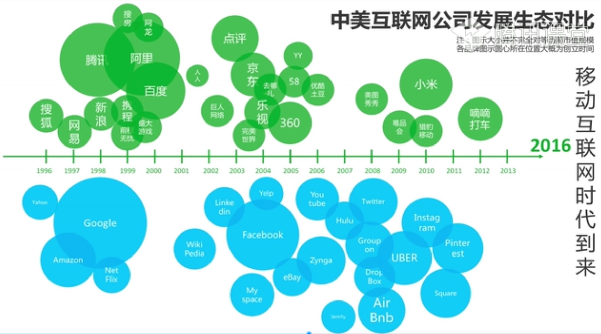

#### 中国互联网第一

- 第一家互联网企业：瀛海威
- 第一个纳斯达克的中国大陆网络股：新浪
- 第一个QQ号：10000（消息通知号）
- 第一次突破一亿网民：2005-06-30
- 第一条微博：你可以当我是个机器人
- 第一个网造节日：双十一

#### 参考书

- 《沸腾十五年》
- 《浪潮之巅》
- 《中国互联网20年：网络大事记篇》
- 《中互联网风云16年》
- 《时代的变化：互联网构建新世界》

#### 中国互联网发展现状

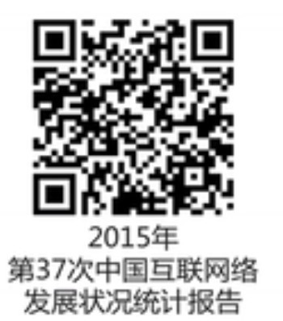

#### 发展现状的个人感受

- 国际领先 比肩世界：对比中美日韩欧/东南亚/印度等的发展
- 中国特色 尚有不足：C2C(Copy to China)/3Q大战/快播
- 剧透骄傲 新秀崛起：BAT/猎豹/小米等
- 略显浮躁 缺乏创新：假数据/伪需求/骗钱骗人
- 大势所趋 充满希望：国家战略 互联网+
### 互联网思维

#### 8个正在发生的重大产业趋势

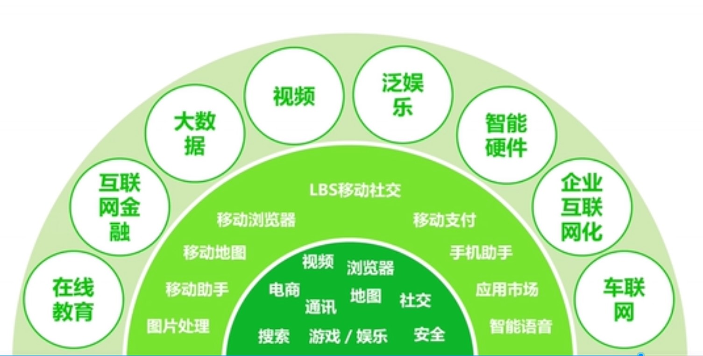

#### 互联网就是未来

- 了解互联网就是了解未来
- 学习互联网就是学习未来
- 抓住了互联网就是抓住了未来

#### 国内市场和国外市场的区别

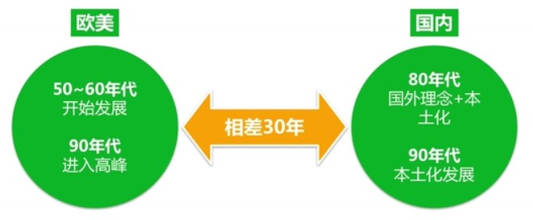

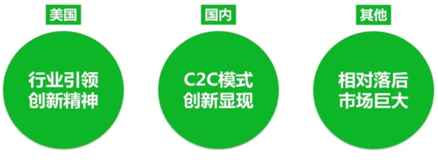

#### 如何处理市场分析的宏观和微观

- 宏观因素
  - 人文环境
    - 人口因素
    - 人口的地理迁移因素
    - 社会因素
  - 经济环境
    - 国民生产总值
    - 个人收入 反应购买力高低
    - 外贸收支情况
  - 自然环境
    - 自然资源 短缺和保护
    - 环境的恶化
    - 疾病的影响
  - 技术环境
    - 技术对企业 竞争的影响
    - 对消费者的影响
  - 政治法律环境
    - 政治格局的稳定
    - 国家的政治法律环境
  - 社会文化环境
    - 教育水平
    - 中教信仰
    - 传统习惯

- 微观因素
  - 供应者
    - 资源的保证
    - 成本的控制
  - 购买者
    - 私人购买者
    - 集团购买者
  - 中间商
  - 竞争者
    - 竞争者及其数量和规模
    - 消费者需求量与竞争供应量的关系
  - 公众
    - 金融公众
    - 政府公众
    - 市民行动公众
    - 地方公众
    - 企业内部公众
    - 一般群众
  - 企业内部各部分写作

### 互联网公司的常见角色

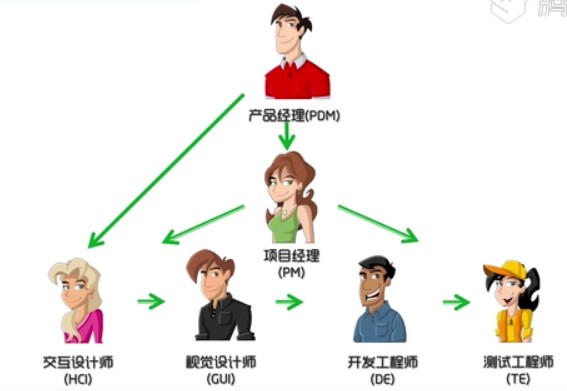

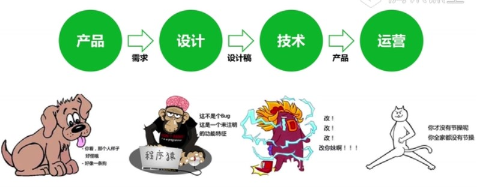

#### 产品经理

如果把产品开发当做赛龙舟产品经理就是站在最前面的擂鼓喊号的人

- 根据公司战略
- 协调多方资源
- 推动产品达到计划中的目标

#### 设计师

- 交互设计师（梳理结构流程&设计界面）
- 视觉设计师（用视觉符号传递信息）

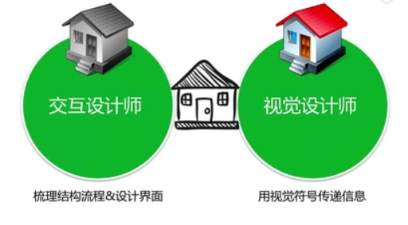

#### 开发/测试/运维

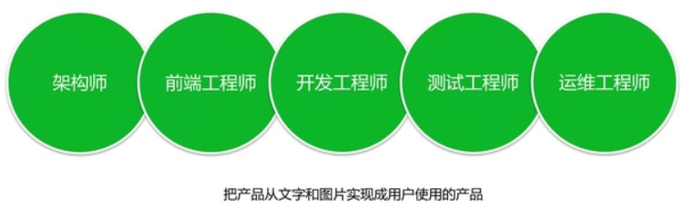

#### 产品运营

## 产品经理的起源和分类

### 产品经理的起源

#### 产品经理的诞生 —— P&G

> 1926年，保洁公司（Procter&Gamble）祖泽姐妹香皂(Camary) 销售的麦克爱尔洛埃提出产品经理管理体制。前期市场调研，用户的需求挖掘，产品的设计和研发过程，到最后上线之后推广营销，能不能有一个来负责主导推动。

Because the people who are crazy enough to think they can change the world are the ones who do. Steve Jobs 活着，就是为了改变世界 1955-2011 乔布斯

#### 产品经理对行业的影响

**在产品中融入科技与人文**

- 淘宝/饿了吗/滴滴/安居客/微信 (产品经理让生活变得更美好)

### 不同平台的产品类型

#### 按产品终端分

1. PC 端
2. Web 端
3. 移动端

[PC端和移动端对比](./images/pc_mobile.jpg)

[移动端和Web端对比](./images/mobile_web.jpg)

### 不同行业的产品类型

[互联网元素周期表](./images/pro_type.jpg)

#### 1. 网络媒体1.0 - 门户网站

- Yahoo - 第一家提供因特网导航服务网站

- 中国五大门户
  - 搜狐
  - 网易
  - 新浪
  - 腾通
  - 凤凰

#### 网络媒体1.5 - 博客

- Blogger开创了媒体UGC方式

- 中国博客代表
  - 博客中国
  - blogbus

#### 网络媒体2.0 - 微博

- Twiter, 社会化分享带来媒体2.0
- 中国的微博之争
  - 新浪
  - 腾讯微博

#### 网络媒体新热点 - 重度化

- Youtube - 技术变革带来的媒体重度化

- 国内
  - 优化
  - 爱奇艺

- Autotrader 美国最大汽车分类网站
- 中国的汽车媒体：汽车之家，易车

#### 网络媒体新热点 - 移动化

- Flipboard，社会化阅读的移动化

- 中国移动阅读
  - 快报（腾讯）
  - 头条

#### 最早的社交网络

- BBS是最早的社交网络
  - 天涯
  - 猫扑
  - discuz
  - 西祠胡同

#### 社交网络的严谨

- Myspace 社区多媒体化
- Qzone 信息为中心到已人为中心
- Facebook 关系链为核心更好连接人
- LinkedIn 通用社交外的垂直化补充
- Moments 高频熟人社交广告价值高

#### IM - 及时通讯

- 聊天室的IM的鼻祖
  - 碧海银沙：www.yinsha.com
  - 网易/新浪/碧海银沙，最早的IM就是聊天室

#### IM的进化史

- ICQ 现代IM之母
- MSN 微软是软件公司
- Skype 软件思维害死人
- QQ 集大成里业之本
- WhatsApp 移动IM启蒙者(facebook收购)
- KaKao Talk 微信的导师
- LineTalk Wechat的竞品
- 微信 是一个生活方式

#### 最早的搜索引擎

《全球目录》最早的搜索引擎，是靠科技先知，人工搜集，分类和帅选完成的

- 中国分类网站
  - 58
  - 赶集
  - hao123 也是一种搜索引擎

#### 搜索引擎的格局

- Google
- 百度
- 360
- 搜狗

#### 搜索引擎的垂直细分

- Quora 知识价值维度的搜索
- 百度知识
- 知乎

### 虚拟商品

#### 前互联网时代的增值服务

- SP彩信/彩铃/IVR是最早的VAS业务

#### 腾讯的第一桶金

- 第二代VAS开始有了人格映射(AVATAR)
  - QQ会员
  - QQ秀

#### 虚拟产品盈利的案例

- YY直播
- 暖暖环游世界

- 影视产品直销的本质是虚拟产品
- 魔兽世界，人格化竞技性趋于极致
- QQ农场，人性极致释放，全民偷菜

#### 移动互联网时代虚拟商品

- 移动游戏 社群属性 大众触点 让移动游戏获得了更大的想象
- IM型社交属性(微信飞机大战) 让游戏扩散度 活跃度 大幅提升
- 移动游戏 PC时代无法想象的回报率

### 电商&O2O

- Amazon 实物电商的鼻祖
- Ebay/Paypal, 电商平台的鼻祖
- 阿里巴巴，最整合的电商平台

#### 垂直电商

- 京东：已经完成平台化的锐变
- 唯品会：精准定位切入的成功案例

#### O2O

- 携程，O2O的先行者
- O2O的领先者 决定性因素是线下的O
  - 大众
  - 美团
  - 滴滴
  - 58

#### 支付闭环

> 支付宝/微信钱包，连接服务支付的闭环

- 京东支付
- 支付宝
- 微信
- 百度钱包

- App Store: 特殊虚拟商店 本质是电商
- 360: 已安全为入口复杂流量转化
- 小米: 精简和Rom入口争夺战略地位
- UC：浏览器为入口复杂流量转化
- 高度：地图为入口 复杂流量转化
- Wifi 万能钥匙：上网为入口 复杂流量转化

- 石油、便利店、餐饮无数线下的入口

### 如何选择行业

- 优势：进入这个行业，你的优势是什么
- 热爱：是否热爱这个行业，为之付出的行动
- 市场：市场规模有多大，近几年增长情况是怎样的
- 竞争：主要竞争者有哪些，各自的市场中的分量如何
- 技术：这个行业的技术是否成熟，还有哪些瓶颈
- 门槛：进入这个行业的壁垒是什么

### 产品经理的工作职责

探索对用户有价值的、可用的、可行的产品 - eBay产品经理及设计高级VP Marty Cagan

#### 工作职责

a. 战略性工作
b. 设计性工作
c. 项目性工作
d. 市场性工作
e. 商业化工作

#### 战略性工作

- 内容
  - 产品战略研究和分析
  - 茶品规划 / 迭代规划
  - 用户分析和市场研究
- 能力
  - 数据分析和思辨能力
  - 战略工具的熟练使用

《定位》

#### 设计性工作

- 内容：交互 / UI / UE
- 能力：工具学习 / 思维训练 / 洞察思考

- 工具：Axure / 墨刀 / Mockplus

#### 项目性工作

- 内容
  - 流程规划
  - 时间管理
  - 任何和人员管理
  - 资源的整合运用
  - 达成项目的目标
- 能力
  - 沟通能力
  - 执行能力
  - 组织能力
  - 协调能力

- 项目管理的四要素
  - T 事件
  - S 范围
  - C 成本
  - Q 质量

#### 市场性工作

- 内容
  - 竞品管理
  - 商务沟通
  - 渠道管理
  - 运营推广
- 能力
  - 沟通能力
  - 调研分析
  - 商务谈判
  - 情商财商

#### 商业化工作

- 内容
  - 商业模式分析
  - 生命周期管理
  - 数据分析验证
  - 产品迭代优化
  - 做好市场拓展
  - 挖创新增长点
- 能力
  - 商业思维
  - 战略思维
  - 全局思维

#### 腾讯的产品经理模型

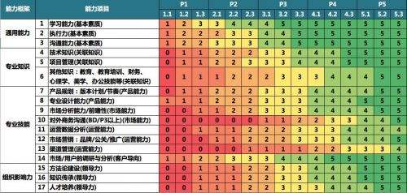

#### 产品经理的成长曲线

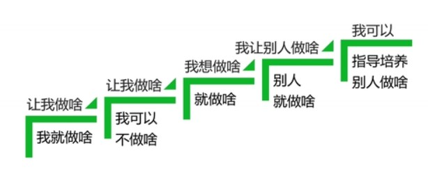

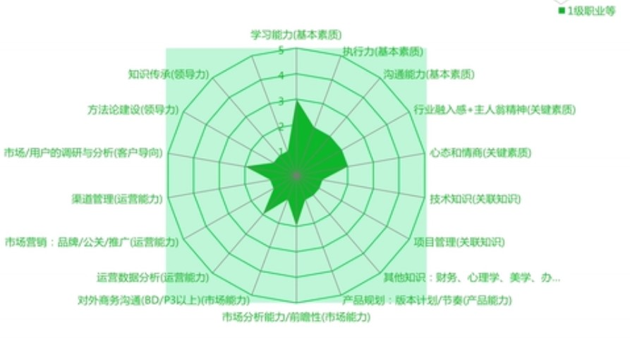

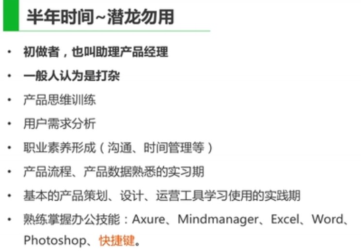

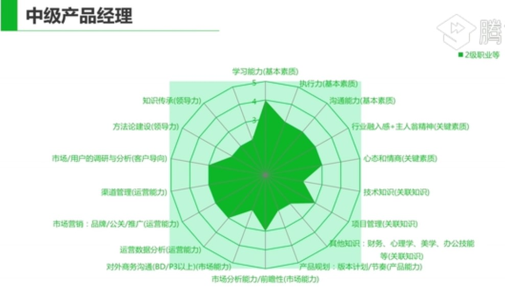

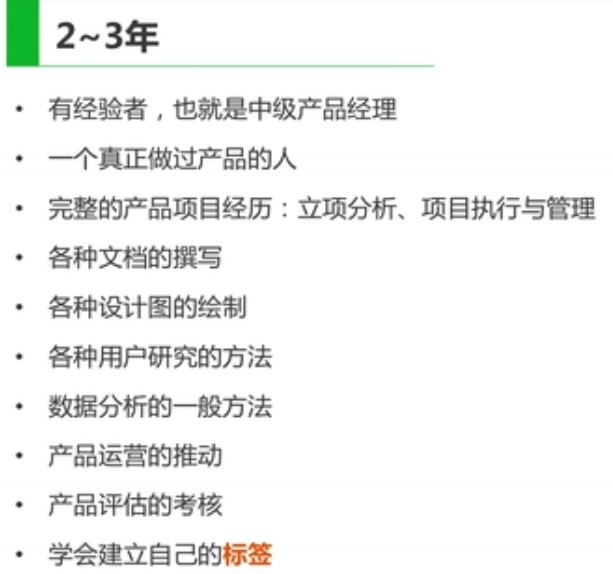

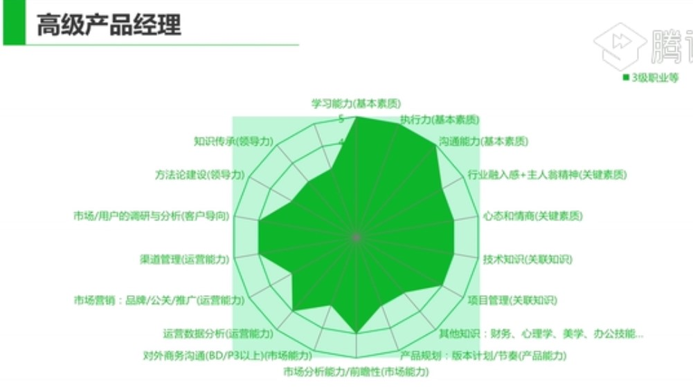

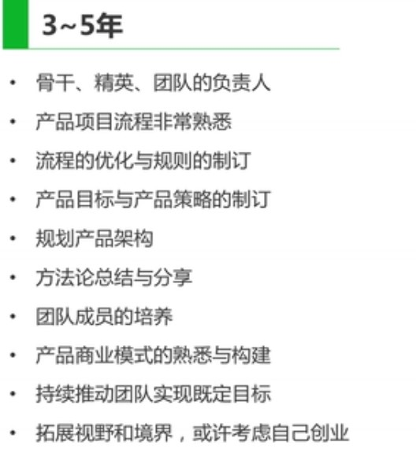

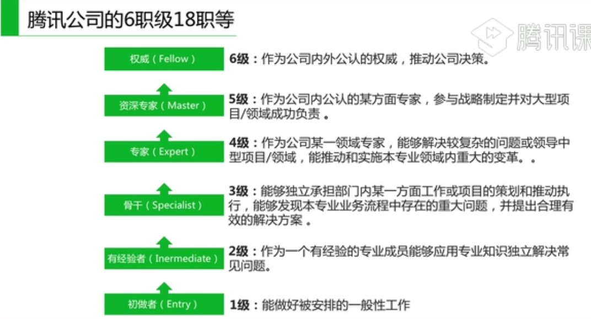

## 市场分析

### 市场分析的方式

#### PEST 分析

> 宏观环境的分析

在分析一个行业/企业/产品所出市场环境

行业/企业/产品：P政治，E经济，S社会，T技术

##### Political Factors

饭否为什么被关闭？“任大炮”微博为何被关？

网友发布了违法相关法律的言论也没有得到及时控制所造成的

- 新浪微博怎么做的？
  - 关键词过滤、封号等监管措施
  - 新浪管理层与政府之间良好的关系，能在某些擦边敏感问题上游刃有余的关键
  - 7*24人工客服快速响应

##### Economic Factors

- 经济因素
  - 利率
  - 通货膨胀率与人均就业率
  - 人均GPD的长远预期
- 除此之外
  - 财政货币政策、失业率水平、居民可支配收入水平、汇率、能源供给成本、市场机制、市场需求

##### Sociocultural Factors

- 社会因素
  - 信奉人数最多的宗教是什么？
  - 这个国家的人对于外国产品和服务的态度如何？
  - 语言障碍是否会影响产品的市场推广？
  - 这个国家的男人和女人的角色分别是什么？
  - 这个国家的人长寿吗？老年阶层富裕吗？
  - 这个国家的人对于环保问题是如何看待的？

##### chnological Factors

- 技术因素
  - 科技是否降低了产品和服务的成本，并提高的质量？
  - 科技是否为消费者和企业提供了更多的创新产品和服务，例如网上银行、新一代手机等？
  - 科技是如何改变分销渠道的，例如网络书店、机票、拍卖等？
  - 科技是如何改变分销渠道的，例如网络书店、机票、拍卖等？
  - 科技是否为企业提供了一种全新的与消费者进行沟通的渠道，例如 Banner广告条、CRM软件等？

### SWOT分析和价值曲线分析

> 对企业/产品内外部条件各方面内容进行综合和概括，今儿分析组织的优劣势、面临的机会威胁一种方法（较为宏观和主观）

- 将公司的战略与公司内部资源、外部环境有机地结合起来

- 优势劣势：相对于竞争对手来书偶的优劣，包括：组织能力、资源和技能等
  - 研发能力
  - 用户基础
  - 市场份额
  - 人力资源
  - 政府公关
  - 客服能力
  - 技术专利
  - 组织架构
- 机会风险：超出了你可控制范围内力量、问题、趋势、事件
  - 技术变化 新客户产生
  - 新市场出现 新商业模式
  - 法律法规变化 市场疲软
  - 趋势改变 政策变化
  - 竞争对 全球经济
  - 产品被替代 费用上涨

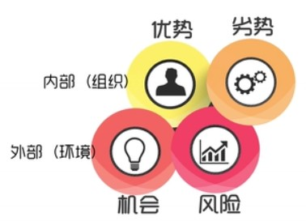

#### SWOT分析结果 - 组合矩阵

- 利用SWOT分析成果，做出**组合矩阵**，填在对应的表格

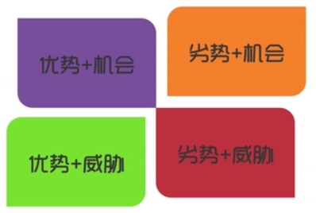

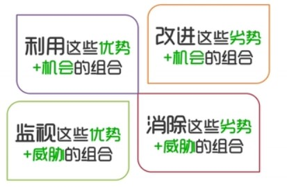

#### 价值曲线分析

定义：通过评价一个公司各关键要素的业绩表现，来评价顾客总体感知服务质量的方法。这里的各**关键要素，也是行业顾客总体评估的各种维度/价值点**

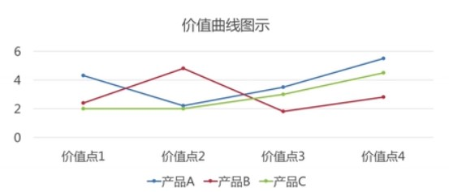

#### 价值曲线评价法的步骤

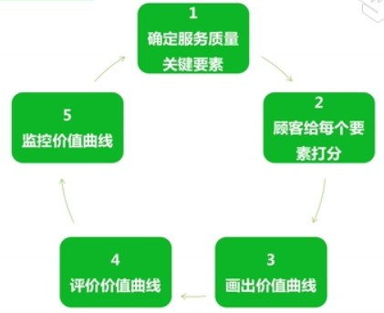

1. 确定行业内顾客感知服务质量的关键要素

各行业之间顾客感知的服务质量的**关键要素不同**

比如，酒店的关键要素：价格、安静程度、卫生、床的质量、房间的设备和舒适度、服务员的服务水平、房间大小、大堂装修、建筑美感、饮食、地理位置等

而对于航空公司的关键要素一般有：安全性、准点率、价格、机型、空姐仪表、航餐、积分等

2. 设计问卷进行市场调研，让顾客给各个要素打分

把关键要素调查问卷中，设计 0~9, 10个分数等级，让顾客根据**期望和要求**给要素打分。目的是找出大多数顾客普遍认为**重要/不重要的因素**以及产品提供的**多余因素**。

问卷最后要设计两个**开放性**问题：

您认为还应当**提供哪些重要的服务项目**？

你认为应当**去掉哪些冗余的服务项目**？

3. 评价价值曲线，提高顾客感知的服务质量

找出**分数最高**和**分数最低**的要素各**三个**，说明在顾客感知的服务质量中，他们分别是最重要和最不重要的三个

产品可以通过**淘汰**某些属性，**创建**某些属性/将某些属性**减少**或者**提升**到行业前所未有的水平组合应用，实现**价值曲线的突破**，从而更加符合顾客的期望和要求，**提高顾客感知的服务质量**

4. 监控价值曲线

产品一旦创造了新的价值曲线，竞争者迟早会企图模仿。为保住顾客群，团队可能陷入一场为取胜的竞争，为抓紧市场份额所困扰，于是，团队可能陷入传统战略逻辑的陷阱。

因此，**动态的应用价值曲线评价方法，即监控价值曲线是非常必要的**，它可使一个团队，在现今的服务中仍然能够得到一个巨大的利润时，就看到并及时抓住质的飞跃机会

### 中国产品国际化的思路和现状